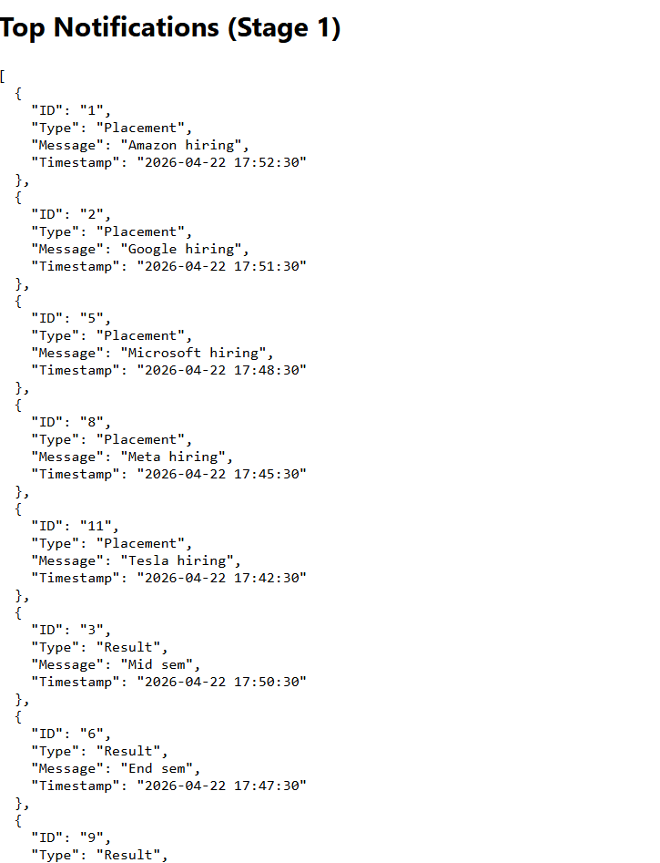

# Stage 1

## Overview

This stage implements a system to fetch notifications and display the top 10 priority notifications based on defined rules.

---

## Approach

* Notifications are fetched from the provided API.
* Each notification contains:

  * ID
  * Type (Placement / Result / Event)
  * Message
  * Timestamp

### Priority Rules:

* Placement > Result > Event
* If same type → latest timestamp first

### Steps:

1. Fetch notifications
2. Sort based on priority and timestamp
3. Extract top 10 notifications

---

## Logging Middleware

A reusable logging function was implemented:

Log(stack, level, package, message)

### Logging is used in:

* API calls (success & failure)
* Sorting logic
* Component lifecycle

This ensures proper debugging and traceability.

---

## Handling Continuous Notifications

In real-world scenarios, notifications keep arriving continuously.

### Efficient Approach:

Instead of sorting the entire dataset repeatedly:

* Use a **Min Heap (Priority Queue)** of size 10.

### Working:

1. Maintain a heap of size 10
2. For each new notification:

   * Compare with lowest priority in heap
   * Replace if higher priority
3. Heap always maintains top 10

### Complexity:

* Heap insert: O(log 10) ≈ O(1)
* Much faster than sorting: O(n log n)

---

## Output

The following screenshot shows the top 10 notifications generated by the application:

---

## Notes

* API calls were tested successfully using Postman.
* Due to CORS restrictions, browser requests were blocked.
* Mock data with identical structure was used in frontend for validation.
* Logging middleware was used throughout the application as required.

---

## Conclusion

The system successfully:

* Processes notifications correctly
* Applies priority logic
* Extracts top 10 efficiently
* Implements structured logging
